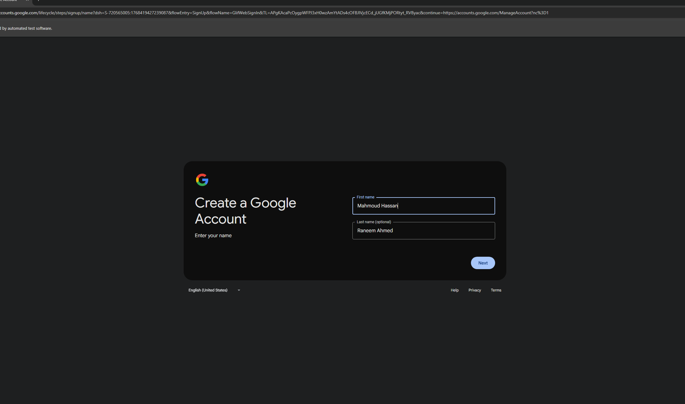

# 🚀 Gmail Creator Pro - The Ultimate Gmail Account Creator

<div align="center">


**✨ The Ultimate Automated Gmail Account Creation Tool ✨**

*Advanced Anti-Detection System • Phone Verification Bypass • 5sim Integration • Beautiful Modern Interface*

[Features](#-key-features) • [Installation](#-installation) • [Usage](#-usage) • [Configuration](#-configuration) • [Support](#-contact--support)

---


*Screenshot of Gmail Creator Pro v2.0.0 in action*

---

</div>

## 📋 Table of Contents

- [Overview](#-overview)
- [Key Features](#-key-features)
- [Screenshots](#-screenshots)
- [Requirements](#-requirements)
- [Installation](#-installation)
- [Configuration](#-configuration)
- [Usage](#-usage)
- [Project Structure](#-project-structure)
- [Advanced Features](#-advanced-features)
- [Troubleshooting](#-troubleshooting)
- [Security & Legal](#-security--legal)
- [Contributing](#-contributing)
- [Contact & Support](#-contact--support)
- [License](#-license)

---

## 🎯 Overview

**Gmail Creator Pro** is a powerful, feature-rich Python automation tool designed for automated Gmail account creation. Built with advanced anti-detection systems, intelligent phone verification bypass, and seamless 5sim API integration, this tool provides a professional solution for bulk Gmail account creation with a beautiful modern interface.

### What Makes This Tool Special?

- 🛡️ **Advanced Anti-Detection** - Human-like behavior simulation to avoid detection
- 🔄 **Smart Phone Verification** - Multiple bypass strategies + 5sim integration
- 🎨 **Beautiful UI** - Rich console interface with real-time progress tracking
- ⚡ **Lightning Fast** - Optimized performance for bulk account creation
- 🔒 **Secure & Configurable** - Separate config files for easy customization
- 📊 **Statistics Dashboard** - Track success rates and account details

---

## ✨ Key Features

### 🚀 Advanced Anti-Detection System
- **Human-like Typing Simulation** - Random delays between keystrokes (0.1-0.3s)
- **Session Warming** - Pre-browsing Google, BBC, Wikipedia, YouTube to appear human
- **Random User Agents** - Rotates browser fingerprints for each account
- **Natural Delays** - Random wait times between actions (0.5-1.2s)
- **Navigator Property Modification** - Hides automation signatures
- **Realistic Name Generation** - Uses names from external file for authenticity

### 🔒 Phone Verification Bypass
- **Multiple Skip Strategies** - Automatically detects and clicks skip buttons
- **Alternative Method Detection** - Tries "Try another way" options
- **5sim API Integration** - Automatic phone number purchase and SMS code retrieval
- **Smart Retry Logic** - Multiple fallback strategies if one fails
- **Multi-language Support** - Works with English and Arabic skip buttons

### 🌐 Smart Proxy Integration
- **Built-in Proxy Support** - FreeProxy integration for IP rotation
- **Automatic Proxy Selection** - Random proxy selection for each account
- **Proxy Validation** - Ensures proxy is working before use

### 💻 Beautiful Modern Interface
- **Rich Console UI** - Beautiful terminal interface with colors and animations
- **Real-time Progress Bars** - Visual progress tracking for account creation
- **Detailed Statistics** - Success rates, total accounts, active accounts
- **Color-coded Messages** - Green for success, red for errors, yellow for warnings
- **Interactive Menu** - Easy-to-use menu system

### 📊 Detailed Statistics
- **Total Accounts Created** - Track all created accounts
- **Active Accounts Count** - Monitor account status
- **Success Rate Percentage** - Calculate creation success rate
- **Last Creation Timestamp** - Track recent activity
- **Account Details** - View all saved account information

### 💾 Auto-Save Accounts
- **JSON Format Storage** - Structured account data storage
- **Automatic Backup** - Accounts saved immediately after creation
- **Account Metadata** - Includes email, password, creation date, status
- **Easy Export** - Simple JSON format for easy data export

### 🔄 Auto-Retry on Failure
- **Robust Error Handling** - Multiple retry attempts on failure
- **Element Detection** - Multiple selector strategies for finding elements
- **Page Load Retry** - Retries page loading if initial attempt fails
- **Smart Fallbacks** - Alternative methods if primary method fails

### ⚡ Lightning Fast Creation
- **Optimized Performance** - Efficient code for fast execution
- **Parallel Processing Ready** - Architecture supports future parallelization
- **Minimal Resource Usage** - Lightweight and efficient
- **Quick Browser Setup** - Fast Chrome driver initialization

### 🔐 Secure Configuration
- **Separate Config Files** - Easy to obfuscate main script while keeping configs editable
- **Password Protection** - Secure password storage in separate file
- **API Key Management** - Secure API key storage
- **No Hardcoded Secrets** - All sensitive data in external files

### 🎯 Additional Features
- **Custom User Agents** - Support for custom user agent lists
- **Custom Names Database** - Use your own name lists
- **Birthday Configuration** - Customizable birthday settings
- **Gender Selection** - Support for Male, Female, Other
- **Multi-language Support** - Works with English and Arabic interfaces
- **ChromeDriver Auto-Management** - Automatic ChromeDriver download and setup

---

## 📸 Screenshots

<div align="center">



*Gmail Creator Pro v2.0.0 - Main Interface*

</div>

### Interface Features:
- **Welcome Banner** - Beautiful ASCII art banner with version info
- **Feature List** - Visual checklist of all features
- **Menu System** - Interactive menu with 5 options
- **Progress Tracking** - Real-time progress bars
- **Statistics Dashboard** - Detailed account creation statistics

---
## 📚 Full Explanation

<div align="center">

### 🎥 YouTube Video Demo

[](https://www.youtube.com/watch?v=2TucpXay1Sk)

</div>

---

### 📝 In-Depth Technical Article

📖 Read the full step-by-step guide and detailed explanation here:  
👉 https://www.shadowhackr.com/2026/01/gmail-creator-pro.html
---
## 📋 Requirements

### System Requirements
- **Operating System:** Windows 10/11 (recommended)
- **Python Version:** Python 3.8 or higher (Python 3.12 recommended)
- **Chrome Browser:** Latest version installed
- **Internet Connection:** Stable internet connection required
- **RAM:** Minimum 4GB (8GB recommended)
- **Disk Space:** 500MB free space

### Python Dependencies

All dependencies are listed in `requirements.txt`. Install them using:

```bash
pip install -r requirements.txt
```

**Required Packages:**
- `selenium>=4.15.0` - Web automation framework
- `webdriver-manager>=4.0.0` - Automatic ChromeDriver management
- `rich>=13.7.0` - Beautiful terminal UI library
- `requests>=2.31.0` - HTTP library for API calls
- `unidecode>=1.3.7` - Text normalization
- `beautifulsoup4>=4.12.0` - HTML parsing
- `fp>=0.1.0` - Free proxy integration

### Optional Requirements
- **5sim API Key** - For automatic phone verification (optional but recommended)
- **Microsoft Visual C++ Build Tools** - For Nuitka compilation (optional)

---

## 🛠️ Installation

### Step 1: Clone the Repository

```bash
git clone https://github.com/ShadowHackrs/gmail-account-creator.git
cd Gmail2025
```

Or download the ZIP file and extract it.

### Step 2: Install Python Dependencies

```bash
pip install -r requirements.txt
```

### Step 3: Configure Settings

Before running the tool, you need to configure the following files:

#### 3.1. Password Configuration

Edit `config/password.txt`:
```
YourStrongPassword123!
```

**Password Requirements:**
- At least 8 characters
- Mix of uppercase, lowercase, numbers, and special characters
- Must meet Google's password requirements

#### 3.2. Names Configuration

Edit `data/names.txt`:
```
Ahmed Mohamed
Mohamed Ali
Omar Ibrahim
Sarah Ahmed
Shadow Hacker
...
```

**Format:**
- One name per line
- Format: "First Last" or just "First"
- Can add as many names as needed

#### 3.3. 5sim API Configuration (Optional but Recommended)

1. **Get your API key** from [5sim.net](https://5sim.net/)
2. **Add your API key** in `config/5sim_config.txt`:
```
your_api_key_here
```

3. **Configure country** in `config/config.py`:
```python
FIVESIM_COUNTRY = "usa"  # Options: usa, russia, ukraine, kazakhstan, etc.
FIVESIM_OPERATOR = "any"  # Options: any, virtual, etc.
```

#### 3.4. User Agents Configuration (Optional)

Edit `config/user_agents.txt`:
```
Mozilla/5.0 (Windows NT 10.0; Win64; x64) AppleWebKit/537.36 (KHTML, like Gecko) Chrome/120.0.0.0 Safari/537.36
Mozilla/5.0 (Windows NT 10.0; Win64; x64) AppleWebKit/537.36 (KHTML, like Gecko) Chrome/119.0.0.0 Safari/537.36
...
```

#### 3.5. General Configuration

Edit `config/config.py`:
```python
# Account Configuration
YOUR_BIRTHDAY = "2 4 1950"  # Format: "month day year"
YOUR_GENDER = "1"  # 1=Male, 2=Female, 3=Other
YOUR_PASSWORD = ""  # Leave empty to read from password.txt

# 5sim API Configuration
FIVESIM_API_KEY = ""  # Leave empty to read from 5sim_config.txt
FIVESIM_COUNTRY = "usa"
FIVESIM_OPERATOR = "any"

# Names Configuration
USE_ARABIC_NAMES = True
NAMES_FILE = "data/names.txt"
```

### Step 4: Verify Installation

Run the script to verify everything is set up correctly:

```bash
python auto_gmail_creator.py
```

You should see the welcome banner and menu. If you see any errors, check the [Troubleshooting](#-troubleshooting) section.

---

## ⚙️ Configuration

### Configuration Files Structure

```
config/
├── config.py          # General settings
├── password.txt       # Account password
├── 5sim_config.txt    # 5sim API key (optional)
└── user_agents.txt   # User agents list (optional)

data/
├── names.txt          # List of names
└── accounts.json      # Created accounts (auto-generated)
```

### Detailed Configuration Guide

#### Account Settings

**Birthday Format:** `"month day year"` (e.g., "2 4 1950")
- Month: 1-12
- Day: 1-31
- Year: 1900-2010 (must be 18+ years old)

**Gender Options:**
- `"1"` - Male
- `"2"` - Female
- `"3"` - Other

#### 5sim API Setup

**Available Countries:**
- `usa` - United States
- `russia` - Russia
- `ukraine` - Ukraine
- `kazakhstan` - Kazakhstan
- And many more (check [5sim.net](https://5sim.net/) for full list)

**Operator Options:**
- `any` - Any available operator
- `virtual` - Virtual numbers only
- Specific operator names

**Getting 5sim API Key:**
1. Visit [5sim.net](https://5sim.net/)
2. Create an account
3. Go to API section
4. Generate API key
5. Add balance to your account
6. Copy API key to `config/5sim_config.txt`

---

## 🚀 Usage

### Basic Usage

1. **Run the script:**
   ```bash
   python auto_gmail_creator.py
   ```

2. **Select option 1** from the menu to create accounts

3. **Enter the number of accounts** you want to create

4. **Wait for completion** - The script will:
   - Open Chrome browser automatically
   - Fill in account information
   - Handle email selection
   - Set password
   - Bypass phone verification (or use 5sim)
   - Save account details to `data/accounts.json`

### Menu Options

```
┌─────────────────────────────────────────────────┐
│  Menu Options                                    │
├─────────────────────────────────────────────────┤
│  1. Create Gmail Accounts 🚀                    │
│     Start creating new Gmail accounts            │
│                                                  │
│  2. View Statistics 📊                          │
│     View detailed creation statistics           │
│                                                  │
│  3. Settings ⚙️                                 │
│     Configure proxy, user agents, and settings │
│                                                  │
│  4. View Saved Accounts 📁                      │
│     View all created accounts and details        │
│                                                  │
│  5. Exit 👋                                     │
│     Exit the application                         │
└─────────────────────────────────────────────────┘
```

### Account Creation Process

The tool follows these steps for each account:

1. **Browser Initialization**
   - Creates Chrome driver with anti-detection settings
   - Sets random user agent
   - Modifies navigator properties

2. **Session Warming** (Optional)
   - Visits Google, BBC, Wikipedia, YouTube
   - Performs random searches
   - Simulates human browsing behavior

3. **Account Information Entry**
   - Fills first name and last name
   - Enters birthday (month, day, year)
   - Selects gender

4. **Email Selection**
   - Chooses "Create your own Gmail address" option
   - Generates username from name + random numbers
   - Validates username availability

5. **Password Setup**
   - Enters password in both fields
   - Validates password strength
   - Proceeds to next step

6. **Phone Verification**
   - Attempts to skip phone verification
   - If skip fails, uses 5sim API (if configured)
   - Enters verification code automatically

7. **Account Completion**
   - Saves account to `data/accounts.json`
   - Displays success message
   - Closes browser

### Viewing Statistics

Select **Option 2** from the menu to view:
- Total accounts created
- Active accounts count
- Success rate percentage
- Last creation timestamp

### Viewing Saved Accounts

Select **Option 4** from the menu to view:
- All created accounts
- Email addresses
- Creation dates
- Account status

---

## 📁 Project Structure

```
Gmail2025/
│
├── auto_gmail_creator.py      # Main script
├── requirements.txt           # Python dependencies
├── README.md                  # This file
│
├── config/                     # Configuration files
│   ├── config.py              # General settings
│   ├── password.txt           # Account password
│   ├── 5sim_config.txt        # 5sim API key
│   ├── user_agents.txt        # User agents list
│   └── README.txt             # Config folder info
│
├── data/                       # Data files
│   ├── names.txt              # List of names
│   ├── accounts.json          # Created accounts (auto-generated)
│   └── README.txt             # Data folder info
│
├── build/                      # Build files (PyInstaller)
│   └── auto_gmail_creator/    # Build artifacts
│
├── dist/                       # Distribution files
│   └── auto_gmail_creator.exe # Compiled executable
│
└── screenshot.png              # Screenshot (add your image here)
```

---

## 🔧 Advanced Features

### Phone Verification Bypass Strategies

The tool uses multiple strategies to bypass phone verification:

1. **Skip Button Detection**
   - Automatically finds and clicks skip buttons
   - Supports English and Arabic skip buttons
   - Multiple selector strategies

2. **Alternative Methods**
   - Tries "Try another way" options
   - Explores alternative verification methods
   - Looks for skip options in alternative flows

3. **5sim Integration**
   - Automatic phone number purchase
   - SMS code retrieval
   - Support for multiple countries
   - Automatic retry on failure

4. **Smart Retry Logic**
   - Multiple fallback strategies
   - Automatic retry on failure
   - Error handling and recovery

### Anti-Detection Features

**Human-like Behavior:**
- Random typing delays (0.1-0.3 seconds per character)
- Natural mouse movements
- Random wait times between actions
- Session warming before account creation

**Browser Fingerprinting:**
- Random user agent rotation
- Navigator property modification
- WebDriver property hiding
- Plugin simulation

**Realistic Data:**
- Names from external file
- Realistic usernames
- Proper birthday format
- Natural gender selection

### 5sim API Integration

**Features:**
- Automatic phone number purchase
- SMS code retrieval with timeout
- Support for multiple countries
- Automatic order management
- Error handling and retry

**Setup:**
1. Get API key from [5sim.net](https://5sim.net/)
2. Add balance to your account
3. Configure API key in `config/5sim_config.txt`
4. Set country in `config/config.py`

**Usage:**
The tool automatically uses 5sim when:
- Skip button is not available
- Alternative methods fail
- Phone verification is required

---

## 🐛 Troubleshooting

### Common Issues and Solutions

#### 1. ChromeDriver Error

**Error:**
```
selenium.common.exceptions.WebDriverException: Message: 'chromedriver' executable needs to be in PATH
```

**Solution:**
- The script automatically downloads ChromeDriver using webdriver-manager
- If issues persist, manually install ChromeDriver or update Chrome browser
- Ensure Chrome browser is up to date

#### 2. Phone Verification Required

**Error:**
```
Phone verification required but skip button not found
```

**Solution:**
- Configure 5sim API key for automatic verification
- Or manually skip when prompted (the script will try multiple skip strategies)
- Check if 5sim account has balance

#### 3. Element Not Found Errors

**Error:**
```
selenium.common.exceptions.NoSuchElementException: Message: no such element
```

**Solution:**
- Google may have updated their UI - check for script updates
- Check internet connection
- Try running again (may be temporary issue)
- Clear browser cache and cookies

#### 4. Import Errors

**Error:**
```
ModuleNotFoundError: No module named 'selenium'
```

**Solution:**
```bash
pip install -r requirements.txt
```

Or install packages individually:
```bash
pip install selenium webdriver-manager rich requests unidecode beautifulsoup4 fp
```

#### 5. Config Files Not Found

**Error:**
```
FileNotFoundError: config/password.txt not found
```

**Solution:**
- Make sure `config/` and `data/` folders exist
- Check file paths in `config/config.py`
- Ensure files are in correct locations
- Create missing files if needed

#### 6. 5sim API Errors

**Error:**
```
5sim API error: 401 - Unauthorized
```

**Solution:**
- Check if API key is correct
- Verify API key in `config/5sim_config.txt`
- Ensure account has balance
- Check 5sim.net for API status

#### 7. Password Validation Errors

**Error:**
```
Password does not meet requirements
```

**Solution:**
- Use strong password (8+ characters)
- Include uppercase, lowercase, numbers, special characters
- Check Google's password requirements
- Update password in `config/password.txt`

#### 8. Names File Empty

**Error:**
```
Error: names.txt is empty or not found!
```

**Solution:**
- Add names to `data/names.txt`
- One name per line
- Format: "First Last" or just "First"
- Ensure file is not empty

### Debug Mode

For detailed error messages:
- Check the console output for color-coded status messages
- Look for detailed error descriptions
- Monitor progress indicators
- Check `data/accounts.json` for saved accounts

### Getting Help

If you encounter issues not listed here:
1. Check the [GitHub Issues](https://github.com/ShadowHackrs/gmail-account-creator/issues)
2. Contact support (see [Contact & Support](#-contact--support))
3. Review the error messages carefully
4. Check internet connection and Chrome browser version

---

## 🔐 Security & Legal

### ⚠️ Important Security Information

**This tool is for educational purposes only.**

- Creating multiple accounts may violate Google's Terms of Service
- Use responsibly and at your own risk
- Accounts created may be subject to verification or suspension
- Keep your API keys secure and never share them
- Config files (`config/`, `data/`) are NOT obfuscated - keep them secure

### Legal Disclaimer

**By using this tool, you agree to:**

- Comply with Google's Terms of Service
- Follow local laws and regulations
- Use the tool responsibly
- Accept responsibility for your actions

**The developers are not responsible for:**
- Any misuse of this tool
- Account suspensions or bans
- Legal consequences
- Data loss or security breaches

### Security Best Practices

1. **Keep Config Files Secure**
   - Don't share `config/password.txt`
   - Don't share `config/5sim_config.txt`
   - Don't commit sensitive files to Git

2. **Use Strong Passwords**
   - Follow Google's password requirements
   - Use unique passwords for each account
   - Store passwords securely

3. **Protect API Keys**
   - Don't share 5sim API keys
   - Use environment variables if possible
   - Rotate API keys regularly

4. **Monitor Account Activity**
   - Check account status regularly
   - Monitor for suspicious activity
   - Keep accounts secure

---

## 🤝 Contributing

We welcome contributions! Here's how you can help:

### How to Contribute

1. **Fork the repository**
2. **Create a feature branch** (`git checkout -b feature/AmazingFeature`)
3. **Commit your changes** (`git commit -m 'Add some AmazingFeature'`)
4. **Push to the branch** (`git push origin feature/AmazingFeature`)
5. **Open a Pull Request**

### Contribution Guidelines

- Follow the existing code style
- Add comments for complex logic
- Test your changes thoroughly
- Update documentation if needed
- Be respectful and professional

### Reporting Issues

If you find a bug or have a suggestion:
1. Check if the issue already exists
2. Create a new issue with:
   - Clear description
   - Steps to reproduce
   - Expected vs actual behavior
   - Screenshots if applicable

---

## 📞 Contact & Support

### Get in Touch

We're here to help! Reach out to us through any of the following channels:

<div align="center">

**🌐 Website:** [https://www.shadowhackr.com](https://www.shadowhackr.com)

**📘 Facebook:** [www.facebook.com/ShadowHackr](https://www.facebook.com/ShadowHackr)

**📱 WhatsApp:** [+962796668987](https://wa.me/962796668987)

</div>

### Support Channels

- **GitHub Issues** - For bug reports and feature requests
- **Email** - Contact through website
- **Facebook** - For general inquiries
- **WhatsApp** - For direct support

### Response Time

- **GitHub Issues:** Usually within 24-48 hours
- **Email:** Within 48 hours
- **WhatsApp:** Usually within a few hours
- **Facebook:** Usually within 24 hours

---

## 📄 License

**© 2025 Shadow Hacker - All Rights Reserved**

This software is proprietary and confidential. Unauthorized copying, modification, distribution, or use of this software, via any medium, is strictly prohibited.

### License Terms

- This software is provided "as is" without warranty
- Commercial use requires explicit permission
- Redistribution is prohibited
- Modification is allowed for personal use only

### Copyright Notice

All rights reserved. No part of this software may be reproduced, distributed, or transmitted in any form or by any means, including photocopying, recording, or other electronic or mechanical methods, without the prior written permission of the copyright holder.

---

## 🎯 Tips for Best Results

### Maximize Success Rate

1. **Use 5sim API** - Significantly improves success rate
   - Automatic phone verification
   - Real phone numbers
   - Higher success rate

2. **Don't Create Too Many Accounts at Once**
   - Space out account creation
   - Wait between batches
   - Avoid rate limiting

3. **Use Strong Passwords**
   - Follow Google's password requirements
   - Use unique passwords
   - Mix of characters

4. **Monitor Success Rate**
   - Check statistics regularly
   - Adjust settings if needed
   - Track account status

5. **Keep Chrome Updated**
   - Ensures compatibility
   - Latest security patches
   - Better performance

6. **Keep Config Files Secure**
   - Don't share sensitive files
   - Use strong passwords
   - Protect API keys

### Best Practices

- **Start Small** - Test with 1-2 accounts first
- **Monitor Progress** - Watch for errors
- **Check Accounts** - Verify created accounts work
- **Backup Data** - Keep copies of `accounts.json`
- **Update Regularly** - Keep script and dependencies updated

---

## 📊 Statistics & Analytics

### Built-in Statistics

The tool provides detailed statistics:

- **Total Accounts Created** - Count of all created accounts
- **Active Accounts** - Accounts with "active" status
- **Success Rate** - Percentage of successful creations
- **Last Creation** - Timestamp of most recent account

### Account Data Format

Accounts are saved in `data/accounts.json`:

```json
[
    {
        "email": "username@gmail.com",
        "password": "YourPassword123!",
        "created_at": "2025-01-14 18:30:43",
        "status": "active"
    }
]
```

---

## 🔄 Updates & Changelog

### Version 2.0.0 (Current)

**New Features:**
- ✅ Enhanced phone verification bypass
- ✅ 5sim API integration
- ✅ Improved error handling
- ✅ Better UI/UX
- ✅ More robust element detection
- ✅ Separated configuration files
- ✅ Organized project structure
- ✅ Beautiful modern interface
- ✅ Real-time progress tracking
- ✅ Statistics dashboard

**Improvements:**
- 🚀 Faster account creation
- 🛡️ Better anti-detection
- 🔒 Enhanced security
- 📊 Better statistics
- 🎨 Improved UI

**Bug Fixes:**
- 🐛 Fixed element detection issues
- 🐛 Fixed password entry problems
- 🐛 Fixed phone verification handling
- 🐛 Fixed browser initialization errors

---

## 🌟 Star History

If you find this project useful, please consider giving it a star ⭐ on GitHub!

---

## 🙏 Acknowledgments

- **Selenium** - For web automation capabilities
- **Rich** - For beautiful terminal UI
- **5sim** - For phone verification services
- **All Contributors** - For their valuable contributions

---

<div align="center">

**Made with ❤️ by SHADOWHACKER**


**© 2025 Shadow Hacker - All Rights Reserved**

[Website](https://www.shadowhackr.com) • [Facebook](https://www.facebook.com/ShadowHackr) • [WhatsApp](https://wa.me/962796668987)

---

⭐ **If you like this project, give it a star!** ⭐

</div>
